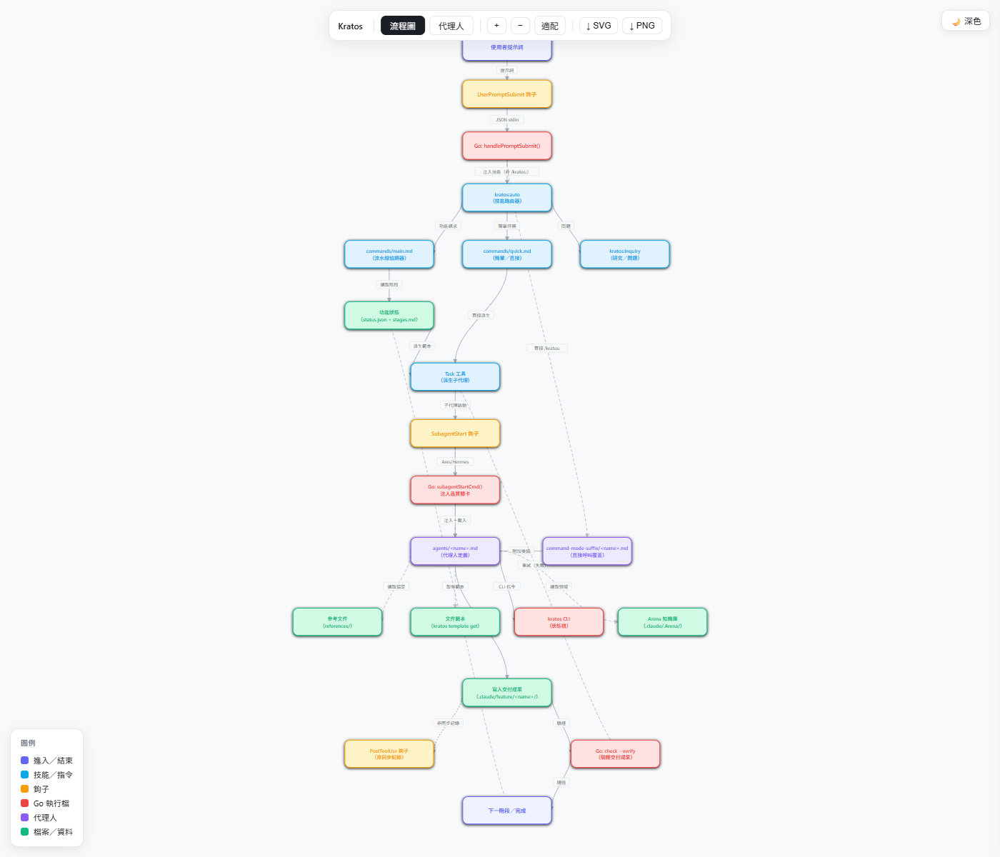

# ⚔️ Kratos — Adversarial Spec-Driven Pipeline for Claude Code

> *"I am what the gods have made me."* — now the gods serve **you**.

    

**Stop shipping AI slop.** Kratos runs your feature through a real pipeline: a PM drafts the PRD, a devil's advocate (**Nemesis**) tears it apart, an architect specs it, and an alignment gate (**Hera**) proves the implementation matches what you *actually* asked for. Named agents, review gates enforced by hooks, persistent memory across sessions — not another pile of subagents.

## Why Kratos, not a single "do the whole feature" agent?

|                                              | One big agent | Agent grab-bags | **Kratos**                       |
| -------------------------------------------- | :-----------: | :-------------: | -------------------------------- |
| Requirements challenged *before* you build   |       ✗       |        ✗        | ✅ Nemesis adversarial review     |
| Implementation verified against the ask      |       ✗       |        ✗        | ✅ Hera alignment gate            |
| Quality gates *enforced*, not just suggested |       ✗       |        ✗        | ✅ Claude Code hooks              |
| Persistent cross-session memory              |       ✗       |      rare       | ✅ SQLite + `/kratos:recall`      |

## What you actually get — lite vs full

Kratos works at two levels. **The markdown layer runs standalone — no build, no binary, no setup.** The optional Go binary only sharpens tracking.

|                                       | Markdown layer *(default)* | + Go binary *(optional)* |
| ------------------------------------- | :------------------------: | :----------------------: |
| All 19 agents + 9-stage pipeline      |             ✅              |            ✅            |
| Commands (`/kratos:quick`, `review`…) |             ✅              |            ✅            |
| Enforced quality-gate hooks           |             ✅              |            ✅            |
| Pipeline timestamps & stage history   |       file fallback        |       ✅ precise         |
| Session memory / recall               |             —              |       ✅ SQLite          |

> Install the plugin and go. Add the binary later if you want precise pipeline tracking.

Kratos is the master orchestrator plugin that commands specialist **agents** to deliver features and wisdom — from quick bug fixes to full 9-stage feature pipelines (stages 1–9, plus optional Stage 0 research), with persistent memory, external research, and git history expertise.

## Recommended: Use Commands, Not the Pipeline

Most tasks don't need the full pipeline. Start with a command — Kratos routes to the right agent directly:

```bash
/kratos:quick Add unit tests for UserService.js    # tests, fixes, small tasks
/kratos:quick debug: TypeError in auth middleware   # debugging
/kratos:review src/auth.ts                          # code review
/kratos:inquiry Who worked on payments last month?  # questions (git, codebase, external)
/kratos:iris good morning                           # daily briefing (routines, todos, advice)
/kratos:iris teach me how CRDTs work                # daily assistant (learn, brainstorm, notes)
/kratos:explain src/core/                           # understand a subsystem
/kratos:audit                                       # pre-ship security/risk scan
/kratos:plan Add authentication                     # tactical plan mode with Odysseus
/kratos:strategy What should we build next?         # strategic planning with Prometheus
```

**Use the full pipeline** (`/kratos:main`) only when building a substantial new feature that benefits from PRD → spec → implement → review stages. For everything else, commands are faster, cheaper, and get you the same agent expertise without the ceremony.

## Installation

For the full step-by-step guide (building the binary, installing hooks, configuring auto-activation), see **[INSTALL.md](INSTALL.md)**.

### Quick Start

```bash
# 1. Add marketplace & install plugin — this alone gets you the full pipeline
claude plugin marketplace add https://github.com/LizardLiang/kratos
claude plugin install kratos@kratos
```

That's it — try `/kratos:quick Add tests for UserService.js`. The markdown layer works with zero further setup.

**Optional — enable precise tracking & memory** (the binary downloads automatically to `~/.kratos/bin/` on first session start; Linux, macOS arm64/amd64, and Windows amd64 all covered):

```bash
~/.kratos/bin/kratos init && ~/.kratos/bin/kratos install   # initialize DB + register hooks
~/.kratos/bin/kratos status                                 # verify
```

Prefer manual download or to build from source? See **[INSTALL.md — Step 3](INSTALL.md#step-3-set-up-the-binary)**.

Then add the auto-activation block to your `CLAUDE.md` (see [INSTALL.md - Step 5](INSTALL.md#step-5-enable-auto-activation)).

> **Note**: The binary is optional. Kratos works without it — agents fall back to direct file edits. With the binary, `status.json` gets real timestamps and full pipeline history.

---

## Architecture

**How a request flows through Kratos** — from your prompt, through the hooks and router, into the right agent, and out to deliverables. Open [`kratos-agent-flow.html`](kratos-agent-flow.html) for the interactive, zoomable version (light/dark, flow & agent views).



<details>
<summary>Text version (agent pantheon)</summary>

```
                         ⚔️ KRATOS ⚔️
                    Master Orchestrator
            (Memory Enabled • Pipeline Orchestration)
                             │
   ┌─────────────────────────┼─────────────────────────────────────────┐
   │                         │                                         │
   ▼                         ▼                                         ▼
┌─────────┐            ┌───────────┐                             ┌───────────┐
│  METIS  │            │   CLIO    │                             │   MIMIR   │
│ Research│            │ Git Hist  │                             │ Ext Res   │
└────┬────┘            └─────┬─────┘                             └─────┬─────┘
     │                       │                                         │
     └───────────────────────┼───────────────────┐                     │
                             │                   │                     │
                             ▼                   ▼                     ▼
┌─────────┐            ┌───────────┐       ┌───────────┐         ┌───────────┐
│ ATHENA  │            │HEPHAESTUS │       │  APOLLO   │         │  HERMES   │
│   PM    │            │ Tech Spec │       │ Architect │         │ Code Rev  │
└────┬────┘            └─────┬─────┘       └─────┬─────┘         └─────┬─────┘
     │                       │                   │                     │
     └───────────────────────┴─────────┬─────────┴─────────────────────┘
                                       │
                              ┌────────┴────────┐
                              │  ARES & ARTEMIS │
                              │  Impl & Quality │
                              └────────┬────────┘
                                       │
                            ┌──────────┴──────────┐
                            │        HADES        │
                            │  Debug (on-demand)  │
                            └─────────────────────┘
```

</details>

## The Pantheon (Agents)

| Agent | Domain | Specialty | Model (Normal) |
|-------|--------|-----------|----------------|
| **Metis** | Project Knowledge | Codebase analysis, Arena documentation | Sonnet |
| **Clio** | Git History | Blame, commit logs, contributor mapping | Sonnet |
| **Mimir** | External Research | Web, GitHub, best practices, documentation | Sonnet |
| **Athena** | Product Management | PRDs, PM reviews, requirements | Opus |
| **Nemesis** | PRD Review | Adversarial devil's advocate + user advocate review | Opus |
| **Daedalus** | Decomposition | Feature phases, dependencies, platform-native tasks | Sonnet |
| **Themis** | Discuss / Decision Lock | Debates implementation choices, writes context.md | Sonnet |
| **Hephaestus** | Engineering | Technical specifications, blueprints, approach selection | Opus |
| **Apollo** | Architecture | System design, SA reviews | Opus |
| **Artemis** | Quality Assurance | Test planning, test cases | Sonnet |
| **Ares** | Implementation | Code writing, bug fixes, refactoring | Sonnet |
| **Hera** | PRD Alignment | Verifies implementation covers all acceptance criteria | Sonnet |
| **Hermes** | Peer Review | Code review, quality audits | Opus |
| **Cassandra** | Risk Analysis | Security, breaking changes, CVEs | Sonnet |
| **Hades** | Debugging | Error location, proof of failure, root cause | Sonnet |
| **Odysseus** | Tactical Planning | Codex/Claude-style plan mode before Ares | Sonnet |
| **Prometheus** | Strategic Planning | Interview-driven prioritized build plans | Opus |
| **Ananke** | Task Management | Personal todo list (binary + file fallback) | Sonnet |
| **Iris** | Secretary | Daily briefing + assistant — learn, brainstorm, dig, notes; knows the user via profile, memory, routines | Sonnet |

---

## Hooks & Quality Gates

Kratos ships Claude Code hooks that enforce workflow discipline automatically — no configuration needed after `~/.kratos/bin/kratos install`.

### SubagentStart — TODO-First Gate

Fires before **Ares** and **Hephaestus** begin work. Injects a mandatory reminder that agents must write a numbered TODO list before making any tool calls.

For **Hermes**, this hook creates a `hermes-checklist.json` that tracks tier-by-tier review progress and injects the tier review instructions.

### SubagentStop — Deliverable Verification

Fires when **Ares** or **Hephaestus** attempt to finish. Blocks completion and forces continuation if:

| Agent | Check |
|-------|-------|
| **Ares** | Must have written a TODO list, mentioned specific files modified, and declared completion |
| **Hephaestus** | Spec must cover at least 2 of: architecture, data model, API, implementation, schema, interface |

When `stop_hook_active` is true (hook-triggered re-run), the gate passes automatically to prevent infinite loops.

**Ares verify gate (v2.87):** the same SubagentStop hook scans the session transcript and blocks Ares completion when code files were edited but no test command ran — fail-open on scan errors, and waived by stating `TESTS-NOT-APPLICABLE: <reason>` for changes with no runtime surface. The check is sidechain-scoped, so it only looks at the subagent's own activity. Ares also records fail-then-pass evidence per task in `implementation-notes.md` — a RED (failing) result before the fix and a GREEN (passing) result after — which Hera verifies at Stage 8.

### PreToolUse — Plan Guard + Package Manager Auto-Correction

For **Odysseus**, the plan guard enforces tactical Plan Mode when Claude includes agent identity in the hook payload:

| Tool | Odysseus Rule |
|------|---------------|
| `Write` / `Edit` / `MultiEdit` | Only `.claude/.Arena/tactical-plans/*.md` |
| `Bash` | Read-only inspection commands only |

If the hook payload does not identify the active agent, the guard fails open so it does not interfere with normal Ares or pipeline work.

Intercepts every `Bash` tool call containing `npm` and rewrites it to the project's actual package manager, detected from lockfiles in the project root:

| Lockfile | Detected PM |
|----------|-------------|
| `bun.lockb` | `bun` |
| `yarn.lock` | `yarn` |
| `pnpm-lock.yaml` | `pnpm` |

If no alternative lockfile is found, `npm` commands pass through unchanged.

### PermissionRequest — Scoped Read Auto-Allow

Fires on every `Read` tool permission request. `permission-read.cjs` auto-allows the read **only** when the requested file path resolves under the plugin's own root (`CLAUDE_PLUGIN_ROOT`) or `~/.kratos/` — Kratos's own files and database. Every other path (project source, `.env`, `~/.ssh`, anything outside those two roots) is left untouched and falls through to Claude Code's normal permission prompt. The hook fails open: empty/garbage input, a missing file path, or an unset `CLAUDE_PLUGIN_ROOT` all produce no output, so the request is never silently allowed by default.

### Reducing Permission Prompts in Pipeline Runs

Ares subagents spawn with `mode: "acceptEdits"`, so file edits are auto-approved inside the spawn (Hermes review is the quality gate). **Bash commands still prompt**, and a foreground subagent waiting on a permission prompt looks like a hung pipeline — in one real session an Ares spawn sat 71 minutes on a single approval. For pipeline-heavy projects, add a build/test allowlist to the project's `.claude/settings.json` (tailor to your stack — allow only commands you'd approve every time):

```json
{
  "permissions": {
    "allow": [
      "Bash(npx tsc*)",
      "Bash(npm test*)",
      "Bash(npm run build*)",
      "Bash(go test*)",
      "Bash(git status*)",
      "Bash(git diff*)"
    ]
  }
}
```

---

## Commands

Commands are the primary interface. Each routes directly to the right agent — no pipeline overhead.

| Command | Purpose | When to Use |
|---------|---------|-------------|
| `/kratos:quick` | **Simple Tasks** — Direct routing for tests, fixes, debug | Day-to-day work: bug fixes, tests, small features |
| `/kratos:review` | **Code Review** — Standards-enforced with severity tiers and auto-fix | Before merging any PR |
| `/kratos:inquiry` | **Knowledge Seek** — Routes to Metis, Clio, or Mimir | Questions about codebase, git history, or external docs |
| `/kratos:explain` | **Explain Codebase** — Architecture, patterns, history, and the "why" | Onboarding or understanding unfamiliar code |
| `/kratos:iris` | **Secretary** — Daily briefing, learn a topic, think through an idea, take notes | Start your day, or daily assistance outside the pipeline |
| `/kratos:plan` | **Plan Mode** — Odysseus creates tactical implementation plans for Ares | Before Ares on ambiguous implementation work |
| `/kratos:strategy` | **Strategic Plan** — Prometheus interviews you and produces a prioritized build plan | Starting a new initiative, roadmap, or sprint plan |
| `/kratos:decompose` | **Decompose** — Break features into phases (files, Notion, Linear) | Large feature needs phased delivery |
| `/kratos:audit` | **Pre-Ship Audit** — Security, breaking changes, CVEs, scalability | Before release or deploy |
| `/kratos:recall` | **Session Resume** — Where did we stop? (uses persistent memory) | Picking up after a break |
| `/kratos:wrap` | **Session Wrap** — Writes a handoff loaded on demand (say "continue" or `/kratos:recall`), runs the memory sweep inline | Before `/clear`, splitting a long session |
| `/kratos:status` | **Battlefield View** — Status of all active features | Checking pipeline progress |
| `/kratos:spec-view` | **Spec View** — Living specs by capability, plus pending deltas | Checking what the system SHALL do |
| `/kratos:spec-archive` | **Spec Archive** — Promote a feature's spec delta into its living spec | After implementation, anytime (doesn't require Hera) |
| `/kratos:spec-backfill` | **Spec Backfill** — Migrate pre-existing shipped features into living specs | One-time sweep after adopting living specs on an established project |
| `/kratos:spec-export` | **Spec Export** — Pretty-print living specs to a self-contained HTML or Markdown document | Sharing specs offline, printing to PDF, pasting into a wiki/PR |
| `/kratos:retro` | **Agent Retro** — Review per-agent lessons from your corrections, fold stable ones into the agent's definition | Periodically, when a god has accumulated lessons |
| `/kratos:main` | **Full Pipeline** — 9-stage PRD → spec → implement → review | Only for substantial new features |

Every agent also has an inline command (`/kratos:athena`, `/kratos:ares`, `/kratos:hephaestus`, …) that runs it directly in the main session instead of spawning a subagent.

---

## Code Review Standards

Kratos ships with a tiered review standard that Hermes enforces on every review:

| Tier | Name | What it checks |
|------|------|---------------|
| 1 | **Correct** | Logic, edge cases, silent failures |
| 2 | **Safe** | Security, injection, secrets, auth |
| 3 | **Clear** | Readability, naming, complexity |
| 4 | **Minimal** | Dead code, over-engineering |
| 5 | **Consistent** | Project conventions |
| 6 | **Resilient** | Error handling, cleanup |
| 7 | **Performant** | N+1, blocking ops, waste |

Rules live in `rules/` (global baseline) and `.claude/.Arena/review-rules/` (project-specific, higher priority). Language-specific rules (React, TypeScript, Python, etc.) are loaded automatically based on detected file types.

Hermes tracks tier completion via `hermes-checklist.json` (created by the SubagentStart hook). The `hermes-list` CLI commands let Hermes update this checklist without direct file edits.

```bash
/kratos:review src/auth.ts           # review a file
/kratos:review --staged              # review staged changes
/kratos:review --branch feat/login   # review a branch diff
/kratos:review src/components/ power # full directory, power mode
```

Hermes reports `[BLOCKER]`, `[WARNING]`, and `[SUGGESTION]` findings — BLOCKERs must be resolved before approval. Auto-fixable issues are proposed with diffs and applied with confirmation.

---

## Execution Modes

Tailor Kratos's power to your needs by prefixing any request:

| Mode | Trigger | Models Used |
|------|---------|-------------|
| **Eco** | `eco:`, `budget:`, `cheap:` | Haiku/Sonnet — token efficient |
| **Normal** | (default) | Balanced Opus/Sonnet mix |
| **Power** | `power:`, `max:`, `full-power:` | Opus for all agents |

---

## The Pipeline (Complex Features Only)

For substantial new features that need formal requirements, specs, and review — use `/kratos:main`. For everything else, use commands above.

```
[0] Research (Metis) — optional pre-flight codebase scan
[1] PRD (Athena) — gap analysis, clarification, requirements
[2] PRD Review (Nemesis) — adversarial + user advocate
[3] Decompose (Daedalus) — optional, phases + dependencies
[3b] Discuss (Themis) — optional, lock implementation decisions → context.md
[4] Tech Spec (Hephaestus) — approach selection, gray areas, blueprint
[5] SA Review (Apollo)
[6] Test Plan (Artemis)
[7] Implement (Ares) — Ares mode or User mode
[8] PRD Alignment (Hera)
[9] Review (Hermes + Cassandra) — parallel
```

Pipeline state is tracked in `.claude/feature/<name>/status.json`. When the Kratos binary is installed, agents use `kratos pipeline update` to write real timestamps and maintain history. Without the binary, agents fall back to editing the file directly.

---

## Persistent Memory

All sessions, agent spawns, decisions, and file changes are recorded in a SQLite database. Use `/kratos:recall` to resume where you left off — context is automatically injected into new sessions.

### Arena — Shared Project Knowledge

The Arena (`.claude/.Arena/`) is Kratos's pull-model knowledge base. Agents read what they need from it, nothing is injected automatically. Metis bootstraps it on first run; all other agents append to it as part of their missions.

**Structure:**
```
.claude/.Arena/
├── index.md                  ← always read first — registry of all shards
├── glossary.md               ← domain terms (flat dated list)
├── constraints.md            ← hard limits with external origin
├── debt.md                   ← known issues, active workarounds
├── project/overview.md       ← project purpose, goals, users
├── architecture/             ← system design, component decisions
├── tech-stack/               ← one shard per stack layer
├── conventions/              ← one shard per coding domain
├── features/                 ← digest of past completed features
├── research/                 ← Mimir's cached external research (TTL)
└── review-rules/             ← Hermes review standards and proposals
```

Sharded files use an evidence format for every entry:
```
[YYYY-MM-DD | agent | feature-name] entry content
```

Each shard has a `## Permanent` section (written only by Metis at bootstrap, Athena, and Hephaestus) and an `## Entries` section (written by any authorized agent, subject to pruning). See `references/arena-protocol.md` for the full read/write protocol.

**Who reads what:**

| Agent | Reads | Writes |
|-------|-------|--------|
| Metis | — (bootstrapper) | All shards (initial) |
| Athena | project/, glossary.md, constraints.md | glossary.md, constraints.md |
| Hephaestus | architecture/, tech-stack/, conventions/, glossary.md | architecture/, tech-stack/, conventions/ (+ Permanent) |
| Apollo | architecture/, constraints.md, tech-stack/, conventions/ | — |
| Artemis | tech-stack/, conventions/ | — |
| Ares | conventions/, tech-stack/, debt.md | conventions/, tech-stack/, debt.md |
| Hermes | conventions/, constraints.md, review-rules/ | debt.md, conventions/, review-rules/ |
| Hades | architecture/, debt.md | debt.md |

---

## Living Specs

A living spec is the durable, capability-scoped record of what the system SHALL do: `.claude/.Arena/specs/<capability>/spec.md`. Unlike the PRD (per-feature, point-in-time), living specs accumulate across features and stay current.

The lifecycle:
1. Athena authors a **spec delta** per feature at `.claude/feature/<slug>/spec-delta/<capability>.md` — ADDED/MODIFIED/REMOVED/RENAMED requirements.
2. After Hera returns an `aligned` verdict (or anytime, manually), promote the delta with `/kratos:spec-archive <slug>` — merges it into the living spec and archives the delta file.
3. `/kratos:spec-view` renders living specs and lists pending (un-archived) deltas — read-only.
4. `/kratos:spec-backfill` is a one-time (or occasional) sweep that generates living specs from features that shipped before the spec-lifecycle existed.
5. `/kratos:spec-export` pretty-prints living specs (never pending deltas) to a self-contained HTML or Markdown document — for offline browsing, printing to PDF, or pasting into a wiki/PR.

See `references/arena-protocol.md` for the full validation and merge rules.

---

## Usage Examples

```bash
# Most tasks — use commands directly
/kratos:quick Add unit tests for UserService.js
/kratos:quick debug: TypeError: Cannot read properties of undefined
/kratos:review src/auth.ts
/kratos:inquiry Who worked on the login page last month?
/kratos:explain src/core/engine.ts
/kratos:audit
/kratos:recall

# Eco mode (cheaper) or Power mode (all-Opus)
eco: what's the most efficient way to handle large file uploads in Node.js?
power: review the payment processing logic for security vulnerabilities

# Full pipeline — only for complex new features
/kratos:main Build a multi-tenant subscription system
```

---

## Pipeline Walkthrough — Stage by Stage

### Starting a New Feature

```bash
/kratos:main Build a user authentication system with OAuth2
```

Kratos classifies the request as COMPLEX, finds no active feature, and asks for a feature name and priority. It then creates `.claude/feature/<name>/status.json`, `arena-deltas.md`, and `README.md`. Athena is spawned for Stage 1.

---

### Stage 1 in Detail — Athena's Gap Analysis

Athena starts by parsing what you actually said:

- **Explicit**: What did you literally state?
- **Implicit**: What assumptions would be needed to write the PRD right now?
- **Ambiguity Level**: How many valid interpretations exist?

Athena then runs a 17-item gap checklist (covering scope, users, constraints, success criteria, data needs, and integration requirements) and scores clarity across three weighted dimensions:

| Dimension | Weight | What it Measures |
|-----------|--------|-----------------|
| Goal Clarity | 40% | Can the feature be stated in one sentence without guessing? |
| Constraint Clarity | 30% | Are restrictions (scale, security, deadlines) specified? |
| Success Criteria | 30% | Are acceptance criteria concrete and testable? |

If ambiguity > 10%, Athena asks **one question at a time** with a recommended answer. It follows a **depth-first** path — completing one branch of questions all the way to a leaf before switching topics. When clarity reaches 90%+ (or Athena can honestly say "I could write this PRD without guessing on any major decision"), it writes the PRD in the same invocation — no separate spawn needed.

**Self-Alignment Check (BLOCKING):** Before completing the PRD, Athena re-reads your original request verbatim, restates what you actually asked for in one sentence, and verifies the PRD answers that exact ask — comparing nouns and verbs, not vibes. If the PRD has drifted (even subtly), Athena rewrites before completing. The alignment verdict is recorded in `decisions.md` under `## Intent Alignment`.

**Decision Tree:** After the PRD body, Athena appends a `## Decision Tree` section to `prd.md` reconstructing the full gap analysis conversation — all branches, all answers, all assumptions — so downstream agents can trace why requirements are shaped the way they are.

**The verbatim text of your first request is preserved in every subsequent stage.** Nemesis, Hephaestus, and Hermes all compare against it.

---

### Stage 2 in Detail — Nemesis's Adversarial Review

Nemesis reviews from two angles simultaneously:
- **Devil's advocate**: What assumptions in the PRD are untested? What edge cases are missing? What could break in production?
- **User advocate**: Does the PRD actually solve the user's real problem, or does it solve the PM's interpretation of the problem?

Nemesis also checks for **Intent Drift** — if the PRD answers a different question than the user's original request, this is a `[INTENT_DRIFT]` finding and blocks approval.

After review, Nemesis produces one of three verdicts:
- `approved` — PRD passes both lenses, proceed to Stage 3
- `revisions` — specific changes required; Athena revises and re-submits
- `rejected` — fundamental flaw; Kratos escalates to you

A rejection typically means the problem statement is circular, success metrics are immeasurable, or scope is unbounded.

---

### Stage 3b (Optional) — Themis's Decision Lock

After Decomposition (Stage 3) and before Tech Spec (Stage 4), Themis can be invoked to debate implementation choices and lock decisions into `context.md`. This is useful when the feature has meaningful design forks — e.g., should we use a job queue or inline processing? — that would otherwise get silently resolved (or poorly resolved) inside Hephaestus.

Themis writes `context.md` which Hephaestus reads before writing the tech spec. Agents downstream can also read `context.md` to understand why specific implementation choices were made.

---

### Stage 4 in Detail — Hephaestus's Tech Spec

Hephaestus is unique: it **never reads the codebase directly**. Kratos spawns Metis (Haiku) with a directed scan query first. This enforces clean separation between architectural thinking and file exploration.

After receiving the codebase scan, the ANALYZE phase runs **inline in the main session** (AskUserQuestion never reaches the user from a spawned subagent) — presenting 2-3 concrete implementation approaches with tradeoffs, then resolving gray areas one at a time. During spec writing (spawned, non-interactive), Hephaestus returns a `HEPHAESTUS NEEDS DECISIONS` block if new ambiguities surface (edge cases, interface design choices, decision tensions); Kratos asks the user and re-spawns. The spec is never written with silent assumptions.

The tech spec contains:
- Architecture overview and component diagram (ASCII)
- Data model / schema changes
- API design with method signatures
- Step-by-step implementation sequence (ordered by dependency)
- List of files to create and modify
- Non-functional requirements (performance, security, scalability)

---

### Stage 7 in Detail — Ares Mode vs User Mode

**Choosing Ares Mode** (default, AI implements):

Ares processes tasks wave by wave when `decomposition.md` exists. After each wave:
```
Wave 1 complete. Tasks done: [data-model, migrations].
All verify checks passed.
Would you like to set up a checkpoint (commit) before Wave 2?
```
Ares does NOT commit — you do. It stops and waits for your response before proceeding to the next wave.

**Choosing User Mode** (you implement):

Say "User Mode" or "I'll implement this myself" when Kratos reaches Stage 7. Ares creates:
```
.claude/feature/<name>/tasks/
  00-overview.md          ← dependency graph, effort estimates, progress tracker
  01-data-model.md        ← complete, copy-paste ready code with all imports
  02-migrations.md
  03-service-layer.md
  ...
```

Every task file includes: complete production-ready code, all imports, all exports, acceptance criteria, and a `verify` command. No pseudocode, no TODOs.

Mark progress: `/kratos:task-complete 01`, then `/kratos:task-complete all` when done.

---

### Stage 9 in Detail — Parallel Review

Hermes and Cassandra are always spawned in the same response:

**Hermes** evaluates against the 7-tier standard in priority order:
1. **Correct** — logic, edge cases, silent failures
2. **Safe** — injection, secrets, auth boundaries
3. **Clear** — naming, complexity, readability
4. **Minimal** — dead code, over-engineering
5. **Consistent** — project conventions
6. **Resilient** — error handling, cleanup
7. **Performant** — N+1 queries, blocking operations

Hermes tracks tier completion via `hermes-checklist.json` — the SubagentStart hook creates this file and injects tier-by-tier instructions. Findings are `[BLOCKER]`, `[WARNING]`, or `[SUGGESTION]`. Only BLOCKERs trigger Ares re-spawn. Ares is re-spawned **at most once** per review cycle — if a BLOCKER survives the fix, Kratos surfaces it to you.

**Cassandra** scans the code diff (not the spec) for:
- Security vulnerabilities (injection, auth bypass, secrets)
- Breaking API changes affecting callers
- Dependency CVEs
- Reliability risks (missing error handling, race conditions)

Verdicts: `clear` → ship | `caution` → noted, proceed | `critical` → blocked until resolved.

---

## Feature Directory Structure

After a complete pipeline run, a feature directory looks like:

```
.claude/feature/<name>/
├── status.json              ← pipeline state, stage statuses, timestamps
├── arena-deltas.md          ← feature-specific Arena discoveries
├── README.md                ← feature overview and pipeline progress table
├── prd.md                   ← requirements, user stories, acceptance criteria + decision tree
├── decisions.md             ← WHY decisions were made; includes Intent Alignment (Athena)
├── prd-challenge.md         ← Nemesis adversarial review (verdict: approved)
├── context.md               ← optional — Themis implementation choice locks
├── decomposition.md         ← optional — phases and task dependencies
├── tech-spec.md             ← architecture, data model, API, implementation plan
├── spec-review-sa.md        ← Apollo architecture review (verdict: sound)
├── test-plan.md             ← test cases mapped to requirements
├── implementation-notes.md  ← what was built, deviations from spec, tests run
├── prd-alignment.md         ← Hera verification (verdict: aligned)
├── code-review.md           ← Hermes quality review (verdict: approved)
├── risk-analysis.md         ← Cassandra risk findings (verdict: clear/caution)
└── tasks/                   ← only in User Mode
    ├── 00-overview.md
    └── 01-*.md, 02-*.md, ...
```

---

## Troubleshooting

### Agent completed but document is missing

Kratos auto-detects this and re-spawns. If Kratos misses it, say "continue" — the gate check runs again before advancing.

Manual verification:
```bash
ls .claude/feature/<name>/
~/.kratos/bin/kratos pipeline get --feature <name>
```

### Pipeline stuck or stage shows wrong status

```bash
# Inspect full state
~/.kratos/bin/kratos pipeline get --feature <name>

# Reset a specific stage for re-run
# Edit .claude/feature/<name>/status.json
# Change the stage "status" from "complete" to "pending"
# Say "continue" to re-run that stage
```

### Binary unavailable

The `<kratos-bin>` placeholder is injected by the SubagentStart hook at runtime so agents always have the correct binary path. If agents report the binary is unavailable:

```bash
# Manually download the release asset for your platform (see INSTALL.md Step 3, Option B)
mkdir -p ~/.kratos/bin
curl -L -o ~/.kratos/bin/kratos \
  https://github.com/LizardLiang/lizard-market/releases/download/<tag>/kratos-$(uname -s | tr A-Z a-z)-$(uname -m | sed 's/x86_64/amd64/;s/aarch64/arm64/')
chmod +x ~/.kratos/bin/kratos
~/.kratos/bin/kratos install
# (Building from source requires cloning the repo — see kratos-dev/go; source is not shipped with the plugin.)

# Verify hook registration
cat ~/.claude/settings.json | python3 -m json.tool | grep -A3 SubagentStart
```

Agents gracefully fall back to direct `status.json` edits if the binary is unavailable.

### Arena is stale or incorrect

Force a fresh Arena bootstrap:
```bash
# Clear outdated shards (back them up first)
rm -rf .claude/.Arena/

# Spawn Metis to rebuild
/kratos:main          # Kratos will offer Stage 0 when Arena is empty
```

Or target specific shards:
```bash
/kratos:inquiry "Update the conventions Arena shard — we switched from CommonJS to ESM"
```

### Hermes keeps blocking on the same issue

If a BLOCKER persists after one Ares fix, Kratos surfaces it to you rather than looping. At that point:
1. Read `code-review.md` to understand the BLOCKER
2. Fix it manually or ask Ares with a precise instruction
3. Say "continue" to re-run Stage 9

### Status.json timestamps are identical (zero-duration stages)

Agents skipped the two-step status update. Fix manually:
```bash
# Get a real timestamp
~/.kratos/bin/kratos now
# → 2026-05-20T14:30:00+08:00

# Edit status.json and set realistic started/completed timestamps
```

---

## CLI Reference

### Binary Commands

```bash
# Pipeline management
kratos pipeline get --feature <name>              # current state
kratos pipeline update --feature <name> \
  --stage <N> --status in-progress                # mark started
kratos pipeline update --feature <name> \
  --stage <N> --status complete \
  --document prd.md                               # mark done
kratos pipeline update --feature <name> \
  --stage <N> --status complete \
  --verdict approved --document prd-challenge.md  # mark done with verdict
kratos pipeline set-pending --feature <name> \
  --stage <N>                                     # set pending stage for Athena
kratos pipeline discover                          # list incomplete features with stage status
kratos pipeline discover --all                    # list all features including complete
kratos pipeline discover --verify                 # auto-find stage-7-ready feature (Ares)
kratos pipeline next --feature <name>              # compute next stage/agent from status.json
kratos pipeline status [feature]                   # dashboard: progress, health, conflicts
kratos pipeline tasks list --feature <name>        # list stage-7 tasks with progress (User Mode)
kratos pipeline tasks complete <id>... | --all     # mark stage-7 tasks complete (User Mode)
kratos slug <text>...                              # generate a URL/dir-safe feature slug

# Living specs
kratos spec list                                  # living capability shards + requirement counts
kratos spec list --changes                        # pending un-archived deltas across all features
kratos spec show <capability>                     # render one capability's living spec
kratos spec diff <feature>                         # show a feature's pending spec delta
kratos spec validate <feature>                     # validate a feature's spec delta
kratos spec archive <feature>                      # merge a feature's spec delta into its living spec
kratos spec backfill                              # generate living specs from pre-existing shipped features

# Session tracking
kratos session active <project>                   # get session ID
kratos step record-agent <sid> <agent> <model> "desc"
kratos step record-file <sid> <path> created|modified

# Hermes tier tracking
kratos hermes-list check --tier <N>               # mark tier N complete in hermes-checklist.json
kratos hermes-list show                           # print current hermes-checklist.json

# Templates (pipe to file or read inline)
kratos template list
kratos template get prd-template
kratos template get tech-spec-template
kratos template get test-plan-template
kratos template get code-review-template
kratos template get risk-analysis-template
kratos template get implementation-notes-template
kratos template get task-file-template
kratos template get task-overview-template
kratos template get decomposition-template
kratos template get decomposition-notion-template
kratos template get decomposition-linear-template

# Utilities
kratos now                                        # RFC3339 timestamp
kratos status                                     # system health
kratos init                                       # initialize SQLite DB
kratos install                                    # register hooks
kratos uninstall                                  # remove hooks
```

### Template Usage by Agents

| Agent | Template Used |
|-------|--------------|
| Athena | `prd-template` |
| Nemesis | `prd-review-template` |
| Daedalus | `decomposition-template` (+ notion/linear variants) |
| Hephaestus | `tech-spec-template` |
| Apollo | `spec-review-sa-template` |
| Artemis | `test-plan-template` |
| Ares | `implementation-notes-template`, `task-file-template`, `task-overview-template` |
| Hera | (reads prd.md directly) |
| Hermes | `code-review-template` |
| Cassandra | `risk-analysis-template` |

---

## Extending Kratos

### Adding Project-Specific Review Rules

Create rules in the Arena's `review-rules/` shard:

```bash
# Hermes will auto-load rules from this location
.claude/.Arena/review-rules/project-rules.md
```

Rules override the global `rules/default.md`. Higher-specificity rules (project-specific) take precedence over global defaults.

### Adding Language-Specific Rules

Create a file in `rules/<language>.md`. Hermes auto-loads language-specific rules when reviewing files with matching extensions. For example, `rules/react.md` loads when reviewing `.tsx` and `.jsx` files.

### Running Without the Binary

All agents fall back gracefully:
- `status.json` updated via direct file edit using `date` command for timestamps
- Templates retrieved by reading `templates/*.md` directly
- Session tracking silently skipped

The pipeline works correctly without the binary — timestamps may be less precise.

---

## Development & Contributing

Development, issues, and pull requests happen in the `LizardLiang/lizard-market` monorepo, under `plugins/kratos/`. `LizardLiang/kratos` (this repo, if you're reading it there) is a distribution mirror whose history is force-pushed fresh on every publish — please don't open PRs against it.

---

*"The cycle ends here. We must be better than this."* — Kratos guides your project to victory through divine orchestration.
